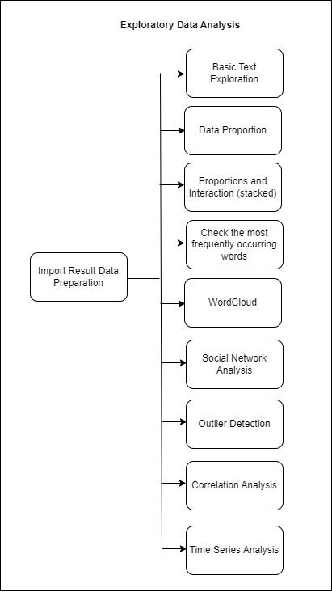
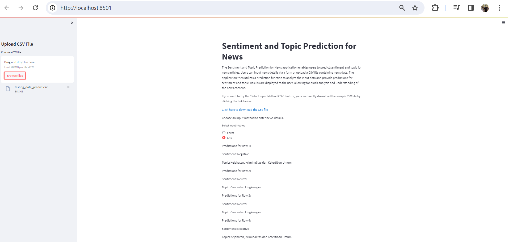

# Sentiment and Topic Prediction for News

## Important Links Related to Sentiment and Topic Prediction for News

Sentiment and Topic Prediction for News App: [https://sentiment-and-topic-prediction-for-news.streamlit.app/](https://sentiment-and-topic-prediction-for-news.streamlit.app/)

Project Documentation: [https://prasetyowidyantoro.github.io/Documentation-for-Automated-Ad-Category-Prediction/](https://prasetyowidyantoro.github.io/Documentation-for-Automated-Ad-Category-Prediction/)

==============================

The Sentiment and Topic Prediction for News application enables users to predict sentiment and topic for news articles. The application then utilizes a prediction function to analyze the input data and provide predictions for sentiment and topic. Results are displayed to the user, allowing for quick analysis and understanding of the news content 


Project Organization
------------

    ├── config
    │   ├── config.yaml                 <- Configuration file that defines various paths and settings for the data project.
    ├── README.md                       <- The top-level README for developers using this project.
    ├── data
    │   ├── raw                         <- The original, immutable data dump.
    │   ├── processed                   <- Intermediate data that has been transformed.
    │   └── final                       <- The final, canonical data sets for modeling.
    ├── docker
    │   ├── api                         <- Dockerfile and requirements for the API service.
    │   │   ├── dockerfile              <- Docker file used for building the API service container.
    │   │   └── requirement.txt         <- Requirements or libraries used to run the API service.
    │   ├── streamlit                   <- Dockerfile and requirements for the Streamlit UI.
    │   │   ├── dockerfile              <- Docker file used for building the Streamlit UI container.
    │   │   └── requirement.txt         <- Requirements or libraries used to run the Streamlit UI.
    ├── docs 
    │   ├── docs             
    │   │   ├── images                  <- Images or screenshots resulting from data processing.
    │   │   ├── about.md                <- Information about the creator of the project.
    │   │   └── index.md                <- Documentation of the Sentiment and Topic Prediction for News Machine Learning project.
    │   ├── mkdocs.yaml                 <- Mkdocs configuration file.
    ├── model                           <- Trained and serialized models, model predictions, or model summaries.
    ├── src
    │   ├── api.py                       <- API service script.
    │   ├── function_1_data_pipeline.py  <- Data pipeline function.
    │   ├── function_2_data_processing.py<- Data processing function.
    │   ├── function_3_modeling.py       <- Modeling function.
    │   ├── streamlit.py                 <- Streamlit UI script.
    │   └── util.py                      <- Utility script.
    ├── training_log                     <- Folder for storing training logs.
    ├── .dockerignore                    <- Docker ignore file.
    ├── .gitattributes                   <- Git attributes file.
    ├── .gitignore                       <- Git ignore file.
    ├── 1. Data Preparation.ipynb        <- Jupyter notebook for data preparation.
    ├── 2. EDA.ipynb                     <- Jupyter notebook for exploratory data analysis.
    ├── 3. Data Preprocessing.ipynb      <- Jupyter notebook for data preprocessing.
    ├── 4. Training Data TFIDF.ipynb     <- Jupyter notebook for training data using TFIDF.
    ├── docker-compose.yaml              <- Docker Compose configuration file.
    └── requirements.txt                 <- The requirements file for reproducing the analysis environment.
                                            Generated with `pip freeze > requirements.txt`.

--------

## Initial Configuration

1. Create a folder to clone the files available on this GitHub page.
2. Clone this GitHub repository.
3. Set up a virtual environment.
4. Activate the created virtual environment.
5. Install the requirements by running `pip install -r requirements.txt`.
6. The files are configured; proceed with the following steps as desired.

## Setting Up "Sentiment and Topic Prediction for News" with Docker

To set up the "Sentiment and Topic Prediction for News" using Docker, follow these steps:

1. Ensure that you have cloned the repository for this program.
2. Install a virtual environment.
3. Activate the created virtual environment.
4. Install the required packages listed in `requirements.txt` by executing:
   ```
   pip install -r requirements.txt
   ```
5. Make sure Docker is activated and that you are logged in.
6. Run the following script in the terminal with the activated virtual environment:
   ```
   docker compose up -d --build
   ```
7. The "Sentiment and Topic Prediction for News" Machine Learning Service is now ready for use.
8. Access the API documentation at [http://localhost:8080/docs](http://localhost:8080/docs) and the UI Front End (Streamlit) at [http://localhost:8501](http://localhost:8501).

## End-to-End Machine Learning Process

The process will encompass Data Annotation, data preparation, Exploratory Data Analysis (EDA), Data Preprocessing, Data Modeling, and culminate in a Machine Learning Service using APIs. The entire system will be integrated into a Streamlit application with Docker for containerization, and the deployment will be facilitated through the Streamlit Share server.

### Data Annotation
**Data Annotation Architecture Diagram**


**Result**


### Data Preparation

**Data Preparation Architecture Diagram**


The data preparation process begins with reading raw data, followed by the definition of columns to be processed. This includes data validation, specifically checking data types, identifying duplicate data, and splitting the data into training, validation, and test sets. Finally, the processed data is saved before proceeding to the data preprocessing stage.

#### Dataset Definition

Here are the data definitions for each column in the provided DataFrame, 25 columns and 24833 row:

1. **Url**: The URL of the article or webpage.
2. **SiteID**: Identifier for the website where the content was published.
3. **SiteName**: Name of the website where the content was published.
4. **SectionID**: Identifier for the section of the website where the content belongs.
5. **SectionName**: Name of the section of the website where the content belongs.
6. **PublishedBy**: Name of the individual or entity who published the content.
7. **SupTitle**: Supplementary title or subtitle of the content.
8. **Title**: Title of the content.
9. **SubTitle**: Subtitle or secondary title of the content, if available.
10. **Description**: Description or summary of the content.
11. **AuthorName**: Name of the author(s) of the content.
12. **AuthorID**: Identifier for the author(s) of the content.
13. **Photo**: Link or identifier for the photo associated with the content.
14. **SourceName**: Name of the original source of the content, if applicable.
15. **Video**: Link or identifier for the video associated with the content.
16. **EmbedSocial**: Information related to embedded social media content, if any.
17. **Tag**: Tags or keywords associated with the content.
18. **Lipsus**: Additional information or summary of the content.
19. **Related**: Related articles or content.
20. **Keyword**: Keywords associated with the content.
21. **Content**: The main textual content of the article or webpage.
22. **UrlShort**: Shortened URL of the article or webpage.
23. **PublishedDate**: Date when the content was published.
24. **sentiment**: Sentiment analysis result indicating whether the content has a negative, neutral, or positive sentiment.
25. **topic**: Labels generated from topic modeling for categorizing the content of news articles.

These definitions provide a clear understanding of the information stored in each column of the DataFrame.

### Exploratory Data Analysis (EDA)

**Exploratory Data Analysis (EDA) Architecture Diagram**



Next is the Exploratory Data Analysis (EDA) phase. In this stage, exploration of the data is conducted to gain a deeper understanding. The process includes several steps. Firstly, Basic Text Exploration is performed, such as finding the "Content" with the longest and shortest names, examining products with titles containing specific characteristics, searching for rows containing punctuation or special characters, and finding rows with multiple spaces in the title column. Secondly, Data Proportion analysis is carried out by checking the proportion of data in terms of both the count and percentage of target labels. Thirdly, Text Representation involves representing words in text data. then, a WordCloud is generated to visualize word frequency, lastly, social network analysis, Time series analysis, outlier detection, and correlation analysis.

### Data Preprocessing

**Data Preprocessing Architecture**


Moving on to the Data Preprocessing stage, the initial step after reading the data prepared in the Data Preparation phase is the execution of post-EDA (Exploratory Data Analysis) actions, which are mandatory. These actions involve various operations aimed at cleaning and transforming the textual data to make it suitable for analysis. 

Firstly, we perform operations such as removing special characters, converting text to lowercase, removing stopwords (commonly occurring words that do not carry significant meaning), and joining the words with a single space. These operations help standardize the text and eliminate noise from the data.

Following this, the data undergoes transformation using Term Frequency-Inverse Document Frequency (TF-IDF) vectorization. TF-IDF assigns weights to unique and important words in a document, thereby distinguishing one document from another based on the frequency and importance of words.

Additionally, label encoding is applied to the target data, both for topics and sentiment. For topics, the label encoding maps each topic category to a numerical value. Similarly, for sentiment analysis, the label encoding assigns numerical values to sentiment categories (Negative, Neutral, Positive).

It's worth noting that stemming or lemmatizing processes are not performed in this preprocessing stage due to their computational intensity and resource requirements, which exceed the available resources at our disposal.

Label to Number Mapping (topic):
Cuaca dan Lingkungan: 0,
Kendaraan dan Transportasi: 1, 
Mode, Gaya, Kebudayaan, dan Pariwisata: 2,
Pemerintahan dan Program: 3,
Kesehatan dan Gizi: 4,
Keuangan dan Teknologi: 5,
Kejahatan, Kriminalitas dan Ketertiban Umum: 6,
Politik dan Olahraga: 7.

Label to Number Mapping (sentiment):
Negative: 0,
Neutral: 1,
Positive: 2

### Data Modeling

**Data Modeling Architecture**


Once the data from the preprocessing stage is saved, it is loaded into the data modeling phase. Subsequently, the data undergoes the modeling process with experiments using various models such as extratrees, xgboost, gradient boosting, SVC, logistic regression, lightgbm, and deep learning. However, the best results, with the optimal evaluation metric values, are obtained using the lighgbm and Logistic Regression model, achieving a Test recall of 0.86 (topic) and 0.77 (sentiment).

## LightGBM:
LightGBM is a powerful gradient boosting framework that stands out in multiclass classification tasks due to its remarkable speed and accuracy. It operates by iteratively training a series of decision trees, with each subsequent tree aiming to rectify the errors made by the preceding ones.

Instead of splitting the tree depth-wise like traditional methods, LightGBM adopts a leaf-wise tree growth strategy. This means it expands the tree node by node, selecting the split that offers the maximum reduction in the loss function. By doing so, LightGBM can efficiently find optimal splits, leading to faster and more effective model training.

In multiclass classification, LightGBM minimizes a specified loss function, typically the cross-entropy loss, to optimize its predictions. This loss function quantifies the difference between the predicted and actual class labels for each sample. By minimizing this loss, LightGBM improves its predictive accuracy across multiple classes.

In essence, LightGBM is highly efficient for multiclass classification, leveraging gradient boosting techniques and optimized tree growth strategies to achieve superior performance.

## Logistic Regression:
Logistic Regression serves as a foundational algorithm for multiclass classification tasks, valued for its simplicity and interpretability. It predicts the probability that each input belongs to each class using the logistic function, also known as the sigmoid function.

The logistic function transforms the linear combination of input features and their respective coefficients into probabilities. Each class's probability is then calculated using the softmax function, which normalizes the probabilities across all classes.

During training, logistic regression adjusts its coefficients to minimize a specific loss function, typically the cross-entropy loss. This loss function quantifies the discrepancy between the predicted and true class labels for each sample. By iteratively minimizing this loss, logistic regression optimizes its parameters to make accurate predictions across multiple classes.

In summary, logistic regression is a straightforward and interpretable algorithm for multiclass classification, making it suitable for tasks where model interpretability is crucial.

**Classification Report Sentiment**


**Classification Report Topic**


## Machine Learning Services Architecture


- The machine learning service process begins with user input, where the provided data is converted into a Pandas dataframe. The input data undergoes a data defense process to ensure compatibility with the pre-trained model. Subsequently, special characters are removed, and the text is converted to lowercase. Stopwords are then removed, and the remaining words are joined with a single space. The cleansed data undergoes transformation using TFIDF, and finally, predictions are made using the pre-trained model saved during the data modeling phase.

- During the prediction phase, users input data through the Streamlit web interface, serving as the front end of the application. Upon the user's click on "Predict," the data is sent as a request to the back end. The back end processes the request and responds with the prediction results to the user.

- This architecture ensures a seamless interaction between the user interface, data preprocessing, and model prediction, providing an end-to-end machine learning service for efficient and user-friendly predictions. The API framework employed in the Machine Learning Service process is FASTAPI, and the front end utilizes Streamlit.

- Following the various processes and saving the model, the next step involves deployment using API and Streamlit. The image below provides an example of accessing ML Services through FASTAPI Swagger UI.

Here is an example of input data used to access the API:

**Prediction using API with FASTAPI**


- This demonstrates the seamless interaction between the user interface, data preprocessing, model prediction, and the API, providing a user-friendly and accessible method for making predictions. To enhance user-friendliness and provide a more powerful interface, users are presented with a simple application built using Streamlit services. Here's an example of how it can be utilized.

**Prediction using API with FASTAPI**


- This demonstrates the seamless interaction between the user interface, data preprocessing, model prediction, and the API, providing a user-friendly and accessible method for making predictions. To enhance user-friendliness and provide a more powerful interface, users are presented with a simple application built using Streamlit services. Here's an example of how it can be utilized.

**Prediction using provided form**


**Prediction using CSV file**



## Conclusion

After thorough experimentation, the LightGBM and Logistic Regression emerged as the top-performing model, achieving an impressive recall of 0.86 (Topic) and 0.78 (Sentiment). Notably, the satisfactory results were attained without the need for data augmentation or balancing.

Sentiment and Topic Prediction for News project embodies a comprehensive end-to-end machine learning solution, encompassing vital stages such as data preparation, exploratory data analysis, data preprocessing, data modeling, and machine learning services. The implementation strategically employs a LightGBM and Logistic Regression to predict Sentiment and Topic Prediction for News, placing a strong emphasis on achieving precision in categorization.

The selected model is fine-tuned to optimize for high recall, ensuring accurate detection of products genuinely belonging to specific categories. The integration of machine learning services through API and Streamlit provides users with a seamless and user-friendly interface for inputting data and receiving predictions effortlessly. Furthermore, the Dockerization of services using Docker Compose facilitates straightforward deployment and scalability.

In essence, the Sentiment and Topic Prediction for News Prediction project serves as a testament to the transformative power of machine learning in enhancing user experience. It establishes an efficient and intuitive system for organizing and categorizing classified Sentiment and Topic Prediction for News.

## Further Research

1. **Exploration with Pre-trained Models:**
   Conducting further exploration using advanced pre-trained models such as BERT, GPT, and others.
   
3. **Evaluation and Application of Data Balancing Techniques:**
   Assessing and implementing data balancing techniques like oversampling or undersampling to address class imbalances.

5. **Collaboration with Domain Experts:**
   Involving collaboration with domain experts and stakeholders to ensure the model adds value in relevant contexts.

4. **Utilizing High-Resource Environments for Experimentation:**
   Leveraging high-resource environments to expedite processes and enable experimentation with stemming and lemmatization techniques. This allows for comprehensive exploration of text preprocessing methods to enhance model performance and efficiency.
   
These proposed steps aim to enhance the model's performance, explore advanced methodologies, and ensure applicability in real-world scenarios through collaborative efforts.

## References

- https://medium.com/@listari.tari/topic-modelling-menggunakan-latent-dirchlect-allocation-part-1-pre-processing-data-dengan-python-87bf5c580923
- https://towardsdatascience.com/end-to-end-topic-modeling-in-python-latent-dirichlet-allocation-lda-35ce4ed6b3e0
- [Multi-Class Classification in Python Example](https://www.projectpro.io/article/multi-class-classification-python-example/547?source=post_page-----81975d03e4a3--------------------------------)
- [Comprehensive Guide to MultiClass Classification with Scikit-Learn](https://towardsdatascience.com/comprehensive-guide-to-multiclass-classification-with-sklearn-127cc500f362?source=post_page-----81975d03e4a3--------------------------------)
- [Binary MultiClass Classification using Scikit-Learn](https://www.kaggle.com/code/satishgunjal/binary-multiclass-classification-using-sklearn?source=post_page-----81975d03e4a3--------------------------------#Train-and-Evaluate-a-Binary-Classification-Model)
- [Understanding Multi-Class Classification](https://builtin.com/machine-learning/multiclass-classification)
- Iskandar Zulkarnain Maulana Putra, T., Farhan Bukhori, A., Ilmu Pengetahuan Alam, dan, & Gadjah Mada, U. (2022). [Model Klasifikasi Berbasis Multiclass Classification dengan Kombinasi Indobert Embedding dan Long Short-Term Memory untuk Tweet Berbahasa Indonesia](https://doi.org/10.35912/jisted.v1i1.1509) (Classification Model Based on Multiclass Classification with a Combination of Indobert Embedding and Long Short-Term Memory for Indonesian-language Tweets). *Jurnal Ilmu Siber Dan Teknologi Digital (JISTED)*, 1(1), 1–28.
- Nugroho, W. H., Handoyo, S., Akri, Y. J., & Sulistyono, A. D. (2022). [Building Multiclass Classification Model of Logistic Regression and Decision Tree Using the Chi-Square Test for Variable Selection Method](https://doi.org/10.55463/issn.1674-2974.49.4.17). *Journal of Hunan University Natural Sciences*, 49(4), 172–181.
- Rabbimov, I. M., & Kobilov, S. S. (2020). [Multi-Class Text Classification of Uzbek News Articles using Machine Learning](https://doi.org/10.1088/1742-6596/1546/1/012097). *Journal of Physics: Conference Series*, 1546(1).
- Kharisudin, I., & Masri'an, H. (2022). Topic Modeling on WhatsApp User Reviews Using Latent Dirichlet Allocation. Scientific Journal of Informatics, 9(1), 51-62. doi:https://doi.org/10.15294/sji.v9i1.34941
- Liu B, Hu M, Cheng J (2005) Opinion observer: Analyzing and comparing opinions on the web In: Proceedings of the 14th International Conference on World Wide Web, WWW ’05, 342–351.. ACM, New York, NY, USA.
- Herlawati, H., Handayanto, R. T., Atika, P. D., Khasanah, F. N., Yusuf, A. Y. P., & Septia, D. Y. (2021). Analisis Sentimen Pada Situs Google Review dengan Naïve Bayes dan Support Vector Machine. Jurnal Komtika (Komputasi Dan Informatika), 5(2), 153–163. https://doi.org/10.31603/komtika.v5i2.6280
- Fransiska, S., & Irham Gufroni, A. (2020). Sentiment Analysis Provider by.U on Google Play Store Reviews with TF-IDF and Support Vector Machine (SVM) Method. Scientific Journal of Informatics, 7(2), 2407–7658. http://journal.unnes.ac.id/nju/index.php/sji
- https://github.com/bryanoliveira/topic-modeling-lda/blob/main/twitter-support-topic-modeling.ipynb
- https://github.com/Nolanogenn/lda_topic_modeling/blob/master/topic_modelling_lda/topic%20modeling%20with%20lda.ipynb
- https://github.com/ktnegron/NLP-BBCNews-LDA-TopicModelling/blob/main/NLP_BBC_topic_modelling_%20.ipynb
- https://github.com/rsreetech/LDATopicModelling/blob/main/LDADemo.ipynb
- https://www.cs.wm.edu/~sunil/Topic%20Modeling.html