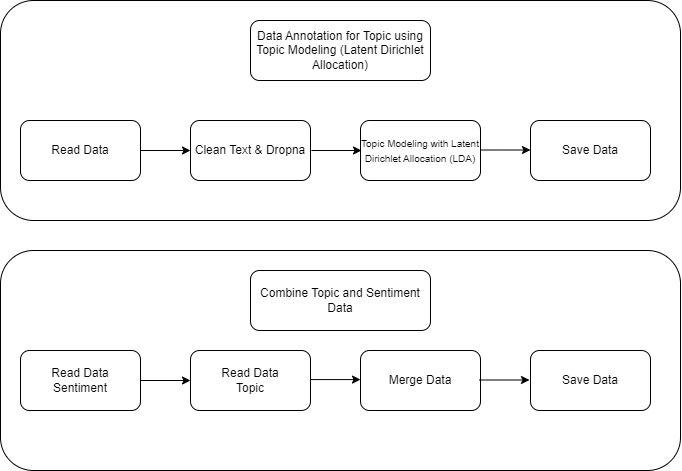
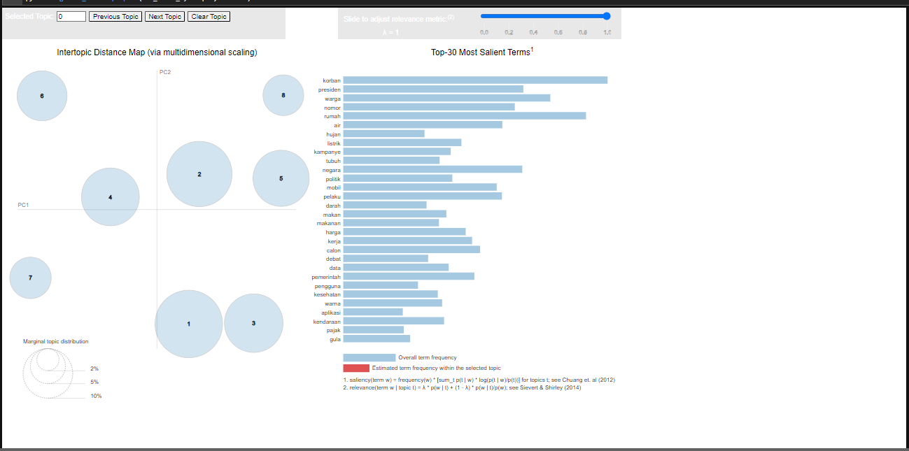
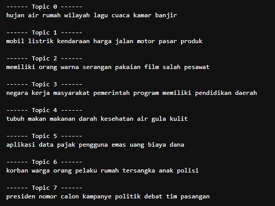
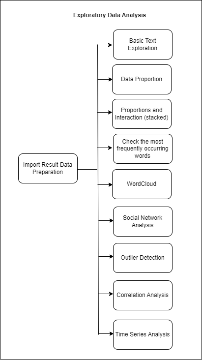
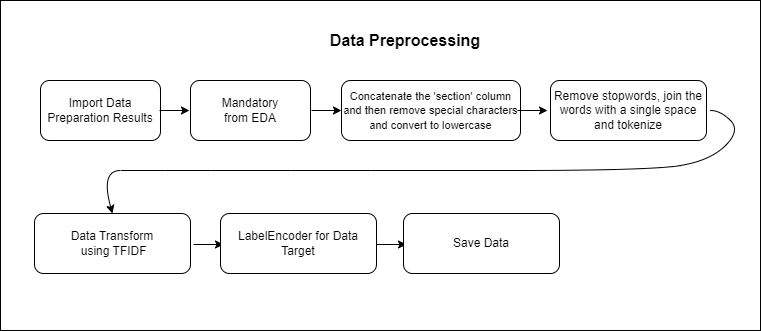
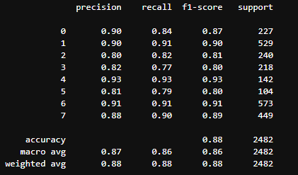
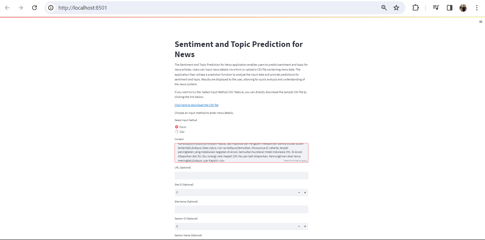
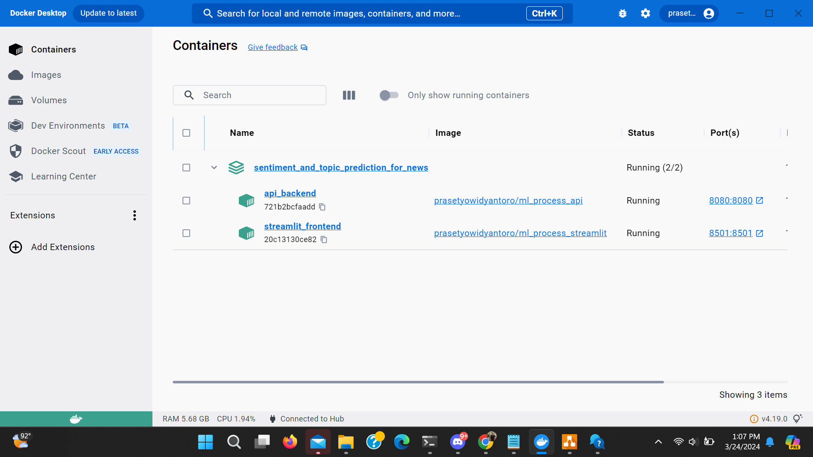

# Sentiment and Topic Prediction for News

## Important Links Related to Sentiment and Topic Prediction for News

Sentiment and Topic Prediction for News App: [https://ai-based-post-categorization-prasetyo-widyantoro.streamlit.app/](https://ai-based-post-categorization-prasetyo-widyantoro.streamlit.app/)

Project Documentation: [https://prasetyowidyantoro.github.io/Documentation-for-Automated-Ad-Category-Prediction/](https://prasetyowidyantoro.github.io/Documentation-for-Automated-Ad-Category-Prediction/)

## Business Problem

In the ever-evolving landscape of digital news platforms, the Sentiment and Topic Prediction for News project focuses on accurately predicting the sentiment and topic classification for articles published on Kompas.com. The primary objective is to address the challenge of precisely identifying the sentiment and topic alignment of each news article, ensuring it authentically represents its content.

The significance lies in the precision of prediction; it's crucial that each news article on Kompas.com is categorized with sentiment and topic labels that genuinely reflect its themes and emotional undertones. The ultimate aim is to enhance user experience on the platform by providing a system that effectively organizes news articles based on their sentiment and topic, facilitating easier navigation and engagement for readers. The success of this project is measured by its ability to streamline the prediction process, offering users a seamless and insightful platform for exploring news content on Kompas.com.

## Business Objective

The primary business objective of the Sentiment and Topic Prediction for News project is to enhance user engagement and satisfaction on the Kompas.com platform by providing accurate sentiment and topic predictions for news articles. This initiative aims to achieve several key goals:

1. **Improved User Experience:** By accurately predicting sentiment and topic labels for news articles, the project seeks to improve the overall user experience on Kompas.com. Users will benefit from a more organized and intuitive platform that allows for easier navigation and discovery of relevant news content.

2. **Personalized Content Delivery:** Through precise sentiment and topic predictions, Kompas.com can offer users personalized content recommendations tailored to their interests and preferences. By understanding the sentiment and topic of each article, the platform can deliver more relevant and engaging content to its audience.

3. **Enhanced Content Organization:** The project aims to optimize content organization on Kompas.com by categorizing news articles based on sentiment and topic. This organized structure will enable users to explore news content more efficiently, leading to increased engagement and satisfaction.

4. **Insightful Analytics:** By analyzing sentiment trends and topic distributions across news articles, Kompas.com can gain valuable insights into user preferences and content consumption patterns. These insights can inform content curation strategies and platform enhancements, ultimately driving user engagement and retention.

5. **Competitive Advantage:** By implementing advanced sentiment and topic prediction capabilities, Kompas.com can differentiate itself from competitors and position itself as a leading provider of personalized and insightful news content. This competitive advantage can attract new users and retain existing ones, contributing to the platform's long-term success.

Overall, the business objective of the Sentiment and Topic Prediction for News project is to optimize user engagement, satisfaction, and retention on the Kompas.com platform through accurate and personalized content recommendations based on sentiment and topic analysis.

## Machine Learning Solution

The initial step in developing the Sentiment and Topic Prediction for News solution begins with the process of data annotation or labeling. Data from the news platform is processed using Topic Modeling techniques with Latent Dirichlet Allocation (LDA) to assign topic labels to each news article. The outcome of this process is topic labels covering various aspects of news, such as Weather and Environment, Vehicles and Transportation, Fashion, Style, Culture, and Tourism, as well as other topics.

Furthermore, the sentiment of each news article is also annotated using a pretrained language model from Hugging Face. This model provides sentiment labels such as Negative, Neutral, and Positive for each news article.

By conducting this data annotation, each news article has been assigned labels that depict the topic and sentiment contained within. The next step is to prepare the data for the classification process, aiming to predict the topic and sentiment of news articles accurately.

Once the annotation process is complete, the data is meticulously prepared to ensure its quality in the classification process. This includes cleaning text from special characters, converting text to lowercase, and removing irrelevant words. Subsequently, important features are extracted from the text using vectorization techniques such as TF-IDF, allowing the text to be transformed into numerical representations that can be utilized by Machine Learning models.

During the modeling phase, various Machine Learning and Deep Learning models are explored and evaluated. After numerous experiments, the chosen model for topic classification is logistic regression with parameter tuning, while for sentiment analysis, the selected model is LightGBM. These models are selected based on their performance and ability to generate accurate predictions for each news article.

With this Machine Learning solution, it is expected to provide accurate predictions for the sentiment and topics of each news article on Kompas.com. This will enhance the user experience by providing a more structured and intuitive platform to navigate through various news articles. Additionally, this solution can assist readers in finding and engaging with content that is relevant to their interests and needs.


## Machine Learning Metrics

Recall is a crucial machine learning metric for evaluating the performance of sentiment and topic prediction models in the context of news articles. Recall measures the proportion of true positive predictions out of all actual positive cases. In the context of sentiment prediction, high recall indicates that the model can effectively identify and classify positive, negative, and neutral sentiments from news articles. Similarly, in the context of topic prediction, high recall indicates that the model can accurately assign news articles to their respective topics, such as weather and environment, transportation, culture and tourism, government and programs, health and nutrition, finance and technology, crime, criminality, and public order, politics and sports.

The evaluation of recall for both sentiment and topic prediction models is essential to ensure that the models can accurately capture the diversity of sentiments and topics present in news articles on the Kompas.com platform. By optimizing recall, the machine learning solution aims to provide users with reliable predictions that enhance their experience and engagement with news content.

## Literature Review

**Topic Modeling on WhatsApp User Reviews Using Latent Dirichlet Allocation**
This research employs Latent Dirichlet Allocation (LDA) to analyze 1710 user reviews of WhatsApp obtained from Google Play in August 2020. The research process involves five stages: problem identification, data retrieval, preprocessing, modeling, and analysis. The analysis results indicate the most frequently discussed topics, such as voice and video calls, call quality, as well as photo and video quality. We use perplexity as an indicator to determine the number of iterations and topics, where lower values indicate better model performance. The analysis phase includes observations of top terms and documents to label and describe the characteristics of each topic, enabling a better understanding of user preferences and experiences with WhatsApp. (Kharisudin, I., & Masri'an, H.,2022)

**Topic Modeling on Online News.Portal Using Latent Dirichlet Allocation (LDA)**
Online news portals often display a plethora of articles without indicating the topics being discussed. However, these articles can still be read and analyzed. In "Your News," you can find the main topics and trends being discussed. You need a quick and efficient way to discover the trending topics in the news. One method to address this issue is through topic modeling. Topic modeling is essential to enable users to easily and rapidly understand modern theme developments.One algorithm used in topic modeling is Latent Dirichlet Allocation (LDA). The research process begins with data collection, preprocessing, n-gram formation, dictionary representation, weighting, topic model validation, topic model formation, and topic modeling results. Based on the topic evaluation results, the best topic modeling values are obtained using coherence related to the number of passes and the number of topics, resulting in 20 passes, 5 topics with a coherence value of 0.53. This is considered sufficiently stable based on the standard coherence value (Fahlevvi, M. R., & Azhari., 2020).

**Multiclass Classification Model Based on the Combination of IndoBERT Embedding and Long Short-Term Memory for Indonesian-language Tweets**

The combination of pre-trained IndoBERT and Long Short-Term Memory (LSTM) yields superior classification results, both on the original and modified datasets. The IndoBERT-LSTM model with optimal hyperparameters (batch size 16, learning rate 2e-5, and average pooling) achieves an F1-score of 98.90% on the original dataset and 92.83% on the modified dataset. The performance improvement of IndoBERT-LSTM over fine-tuned IndoBERT is not significantly pronounced (Iskandar Zulkarnain Maulana Putra et al., 2022).

**Multi-Class Text Classification of Uzbek News Articles using Machine Learning**

In this study, multiclass text classification is applied to texts written in the Uzbek language, specifically news articles from ten categories selected from the Uzbek online news edition "Daryo." Six different machine learning algorithms—Support Vector Machine (SVM), Decision Tree (DTC), Random Forest (RF), Logistic Regression (LR), and Naïve Bayes Multinomial (MNB)—are employed for multiclass text classification. TF-IDF algorithm and n-gram models at the word and character levels are utilized as feature extraction methods. The hyperparameter determination for text classification involves 5-fold cross-validation. Experimental results show the highest accuracy reaching 86.88% (Rabbimov & Kobilov, 2020).

**Building Multiclass Classification Model of Logistic Regression and Decision Tree Using the Chi-Square Test for Variable Selection Method.**

Feature selection using a filter approach indicates that all predictor features depend on the target feature. Independent predictor features include the mother's pre-pregnancy diabetes history (X2), father's blood pressure (X3), father's psychological condition (X8), and drinking water quality (X10). These features serve as inputs to the classification model. The class label distribution in the dataset is imbalanced, with Class 0 dominating around 70% of Class 0 examples, while there are only 0.33% or 3 out of 900 Class 1 examples. This class label distribution imbalance can affect the acquisition of a better classification model. The Decision Tree model outperforms the Logistic Regression model. Performance metrics, including Accuracy, precision, recall, and F1-score, are 90%, 89%, 90%, and 89%, respectively, for Logistic Regression compared to 91%, 90%, 91%, and 90% for the Decision Tree model. Additionally, the Decision Tree model can demonstrate the importance of features in the separation process during model construction (Nugroho et al., 2022).

## End-to-End Machine Learning Process

The process will encompass Data Annotation, data preparation, Exploratory Data Analysis (EDA), Data Preprocessing, Data Modeling, and culminate in a Machine Learning Service using APIs. The entire system will be integrated into a Streamlit application with Docker for containerization, and the deployment will be facilitated through the Streamlit Share server.

### Data Annotation
**Data Annotation Architecture Diagram**




**Result**





In this context, data annotation was conducted using two different methods to gain deep insights into the existing content. Firstly, by applying Topic Modeling technique using Latent Dirichlet Allocation (LDA), we successfully identified eight main topics within the data. Each topic was labeled based on keywords representing the essence of that topic, ranging from weather and environment to politics and sports.

Additionally, we performed sentiment annotation on the data by leveraging a pre-trained language model. This model allowed us to classify the sentiment of each data entity into three categories: Negative, Neutral, or Positive.

In evaluating the annotated data, we used the metrics of Perplexity Multicore and Coherence Score Multicore. A low Perplexity, such as the -8.23 we obtained, indicates better model performance. Meanwhile, a high Coherence Score, such as the 0.57 we achieved, signifies that the topics generated by the model have more consistent and meaningful interpretations. Thus, our annotated data results can be relied upon for further analysis in understanding and interpreting the existing content.

### Data Preparation

**Data Preparation Architecture Diagram**


The data preparation process begins with reading raw data, followed by the definition of columns to be processed. This includes data validation, specifically checking data types, identifying duplicate data, and splitting the data into training, validation, and test sets. Finally, the processed data is saved before proceeding to the data preprocessing stage.

#### Dataset Definition

Here are the data definitions for each column in the provided DataFrame, 25 columns and 24833 row:

1. **Url**: The URL of the article or webpage.
2. **SiteID**: Identifier for the website where the content was published.
3. **SiteName**: Name of the website where the content was published.
4. **SectionID**: Identifier for the section of the website where the content belongs.
5. **SectionName**: Name of the section of the website where the content belongs.
6. **PublishedBy**: Name of the individual or entity who published the content.
7. **SupTitle**: Supplementary title or subtitle of the content.
8. **Title**: Title of the content.
9. **SubTitle**: Subtitle or secondary title of the content, if available.
10. **Description**: Description or summary of the content.
11. **AuthorName**: Name of the author(s) of the content.
12. **AuthorID**: Identifier for the author(s) of the content.
13. **Photo**: Link or identifier for the photo associated with the content.
14. **SourceName**: Name of the original source of the content, if applicable.
15. **Video**: Link or identifier for the video associated with the content.
16. **EmbedSocial**: Information related to embedded social media content, if any.
17. **Tag**: Tags or keywords associated with the content.
18. **Lipsus**: Additional information or summary of the content.
19. **Related**: Related articles or content.
20. **Keyword**: Keywords associated with the content.
21. **Content**: The main textual content of the article or webpage.
22. **UrlShort**: Shortened URL of the article or webpage.
23. **PublishedDate**: Date when the content was published.
24. **sentiment**: Sentiment analysis result indicating whether the content has a negative, neutral, or positive sentiment.
25. **topic**: Labels generated from topic modeling for categorizing the content of news articles.

These definitions provide a clear understanding of the information stored in each column of the DataFrame.

### Exploratory Data Analysis (EDA)

**Exploratory Data Analysis (EDA) Architecture Diagram**


Next is the Exploratory Data Analysis (EDA) phase. In this stage, exploration of the data is conducted to gain a deeper understanding. The process includes several steps. Firstly, Basic Text Exploration is performed, such as finding the "Content" with the longest and shortest names, examining products with titles containing specific characteristics, searching for rows containing punctuation or special characters, and finding rows with multiple spaces in the title column. Secondly, Data Proportion analysis is carried out by checking the proportion of data in terms of both the count and percentage of target labels. Thirdly, Text Representation involves representing words in text data. then, a WordCloud is generated to visualize word frequency, lastly, social network analysis, Time series analysis, outlier detection, and correlation analysis.

### Data Preprocessing

**Data Preprocessing Architecture**


Moving on to the Data Preprocessing stage, the initial step after reading the data prepared in the Data Preparation phase is the execution of post-EDA (Exploratory Data Analysis) actions, which are mandatory. These actions involve various operations aimed at cleaning and transforming the textual data to make it suitable for analysis. 

Firstly, we perform operations such as removing special characters, converting text to lowercase, removing stopwords (commonly occurring words that do not carry significant meaning), and joining the words with a single space. These operations help standardize the text and eliminate noise from the data.

Following this, the data undergoes transformation using Term Frequency-Inverse Document Frequency (TF-IDF) vectorization. TF-IDF assigns weights to unique and important words in a document, thereby distinguishing one document from another based on the frequency and importance of words.

Additionally, label encoding is applied to the target data, both for topics and sentiment. For topics, the label encoding maps each topic category to a numerical value. Similarly, for sentiment analysis, the label encoding assigns numerical values to sentiment categories (Negative, Neutral, Positive).

It's worth noting that stemming or lemmatizing processes are not performed in this preprocessing stage due to their computational intensity and resource requirements, which exceed the available resources at our disposal.

Label to Number Mapping (topic):
Cuaca dan Lingkungan: 0,
Kendaraan dan Transportasi: 1, 
Mode, Gaya, Kebudayaan, dan Pariwisata: 2,
Pemerintahan dan Program: 3,
Kesehatan dan Gizi: 4,
Keuangan dan Teknologi: 5,
Kejahatan, Kriminalitas dan Ketertiban Umum: 6,
Politik dan Olahraga: 7.

Label to Number Mapping (sentiment):
Negative: 0,
Neutral: 1,
Positive: 2,

### Data Modeling

**Data Modeling Architecture**


Once the data from the preprocessing stage is saved, it is loaded into the data modeling phase. Subsequently, the data undergoes the modeling process with experiments using various models such as extratrees, xgboost, gradient boosting, SVC, logistic regression, lightgbm, and deep learning. However, the best results, with the optimal evaluation metric values, are obtained using the lighgbm and Logistic Regression model, achieving a Test recall of 0.86 (topic) and 0.77 (sentiment).

## LightGBM:
LightGBM is a powerful gradient boosting framework that stands out in multiclass classification tasks due to its remarkable speed and accuracy. It operates by iteratively training a series of decision trees, with each subsequent tree aiming to rectify the errors made by the preceding ones.

Instead of splitting the tree depth-wise like traditional methods, LightGBM adopts a leaf-wise tree growth strategy. This means it expands the tree node by node, selecting the split that offers the maximum reduction in the loss function. By doing so, LightGBM can efficiently find optimal splits, leading to faster and more effective model training.

In multiclass classification, LightGBM minimizes a specified loss function, typically the cross-entropy loss, to optimize its predictions. This loss function quantifies the difference between the predicted and actual class labels for each sample. By minimizing this loss, LightGBM improves its predictive accuracy across multiple classes.

In essence, LightGBM is highly efficient for multiclass classification, leveraging gradient boosting techniques and optimized tree growth strategies to achieve superior performance.

## Logistic Regression:
Logistic Regression serves as a foundational algorithm for multiclass classification tasks, valued for its simplicity and interpretability. It predicts the probability that each input belongs to each class using the logistic function, also known as the sigmoid function.

The logistic function transforms the linear combination of input features and their respective coefficients into probabilities. Each class's probability is then calculated using the softmax function, which normalizes the probabilities across all classes.

During training, logistic regression adjusts its coefficients to minimize a specific loss function, typically the cross-entropy loss. This loss function quantifies the discrepancy between the predicted and true class labels for each sample. By iteratively minimizing this loss, logistic regression optimizes its parameters to make accurate predictions across multiple classes.

In summary, logistic regression is a straightforward and interpretable algorithm for multiclass classification, making it suitable for tasks where model interpretability is crucial.

**Classification Report Sentiment**


**Classification Report Topic**




## Machine Learning Services Architecture


- The machine learning service process begins with user input, where the provided data is converted into a Pandas dataframe. The input data undergoes a data defense process to ensure compatibility with the pre-trained model. Subsequently, special characters are removed, and the text is converted to lowercase. Stopwords are then removed, and the remaining words are joined with a single space. The cleansed data undergoes transformation using TFIDF, and finally, predictions are made using the pre-trained model saved during the data modeling phase.

- During the prediction phase, users input data through the Streamlit web interface, serving as the front end of the application. Upon the user's click on "Predict," the data is sent as a request to the back end. The back end processes the request and responds with the prediction results to the user.

- This architecture ensures a seamless interaction between the user interface, data preprocessing, and model prediction, providing an end-to-end machine learning service for efficient and user-friendly predictions. The API framework employed in the Machine Learning Service process is FASTAPI, and the front end utilizes Streamlit.

- Following the various processes and saving the model, the next step involves deployment using API and Streamlit. The image below provides an example of accessing ML Services through FASTAPI Swagger UI.

Here is an example of input data used to access the API:

**Prediction using API with FASTAPI**


- This demonstrates the seamless interaction between the user interface, data preprocessing, model prediction, and the API, providing a user-friendly and accessible method for making predictions. To enhance user-friendliness and provide a more powerful interface, users are presented with a simple application built using Streamlit services. Here's an example of how it can be utilized.

**Prediction using provided form**




**Prediction using CSV file**


## Setting Up "Sentiment and Topic Prediction for News" with Docker

To set up the "Sentiment and Topic Prediction for News" using Docker, follow these steps:

1. Ensure that you have cloned the repository for this program.
2. Install a virtual environment.
3. Activate the created virtual environment.
4. Install the required packages listed in `requirements.txt` by executing:
   ```
   pip install -r requirements.txt
   ```
5. Make sure Docker is activated and that you are logged in.
6. Run the following script in the terminal with the activated virtual environment:
   ```
   docker compose up -d --build
   ```
7. The "Sentiment and Topic Prediction for News" Machine Learning Service is now ready for use.
8. Access the API documentation at [http://localhost:8080/docs](http://localhost:8080/docs) and the UI Front End (Streamlit) at [http://localhost:8501](http://localhost:8501).

### Docker Service

The following are the results of inputting the service into a Docker container:


The following are the results of inputting the service into:


## Conclusion

After thorough experimentation, the LightGBM and Logistic Regression emerged as the top-performing model, achieving an impressive recall of 0.86 (Topic) and 0.78 (Sentiment). Notably, the satisfactory results were attained without the need for data augmentation or balancing.

Sentiment and Topic Prediction for News project embodies a comprehensive end-to-end machine learning solution, encompassing vital stages such as data preparation, exploratory data analysis, data preprocessing, data modeling, and machine learning services. The implementation strategically employs a LightGBM and Logistic Regression to predict Sentiment and Topic Prediction for News, placing a strong emphasis on achieving precision in categorization.

The selected model is fine-tuned to optimize for high recall, ensuring accurate detection of products genuinely belonging to specific categories. The integration of machine learning services through API and Streamlit provides users with a seamless and user-friendly interface for inputting data and receiving predictions effortlessly. Furthermore, the Dockerization of services using Docker Compose facilitates straightforward deployment and scalability.

In essence, the Sentiment and Topic Prediction for News Prediction project serves as a testament to the transformative power of machine learning in enhancing user experience. It establishes an efficient and intuitive system for organizing and categorizing classified Sentiment and Topic Prediction for News.

## Further Research

1. **Exploration with Pre-trained Models:**
   Conducting further exploration using advanced pre-trained models such as BERT, GPT, and others.
   
3. **Evaluation and Application of Data Balancing Techniques:**
   Assessing and implementing data balancing techniques like oversampling or undersampling to address class imbalances.

5. **Collaboration with Domain Experts:**
   Involving collaboration with domain experts and stakeholders to ensure the model adds value in relevant contexts.

4. **Utilizing High-Resource Environments for Experimentation:**
   Leveraging high-resource environments to expedite processes and enable experimentation with stemming and lemmatization techniques. This allows for comprehensive exploration of text preprocessing methods to enhance model performance and efficiency.
   
These proposed steps aim to enhance the model's performance, explore advanced methodologies, and ensure applicability in real-world scenarios through collaborative efforts.

## References

- https://medium.com/@listari.tari/topic-modelling-menggunakan-latent-dirchlect-allocation-part-1-pre-processing-data-dengan-python-87bf5c580923
- https://towardsdatascience.com/end-to-end-topic-modeling-in-python-latent-dirichlet-allocation-lda-35ce4ed6b3e0
- [Multi-Class Classification in Python Example](https://www.projectpro.io/article/multi-class-classification-python-example/547?source=post_page-----81975d03e4a3--------------------------------)
- [Comprehensive Guide to MultiClass Classification with Scikit-Learn](https://towardsdatascience.com/comprehensive-guide-to-multiclass-classification-with-sklearn-127cc500f362?source=post_page-----81975d03e4a3--------------------------------)
- [Binary MultiClass Classification using Scikit-Learn](https://www.kaggle.com/code/satishgunjal/binary-multiclass-classification-using-sklearn?source=post_page-----81975d03e4a3--------------------------------#Train-and-Evaluate-a-Binary-Classification-Model)
- [Understanding Multi-Class Classification](https://builtin.com/machine-learning/multiclass-classification)
- Iskandar Zulkarnain Maulana Putra, T., Farhan Bukhori, A., Ilmu Pengetahuan Alam, dan, & Gadjah Mada, U. (2022). [Model Klasifikasi Berbasis Multiclass Classification dengan Kombinasi Indobert Embedding dan Long Short-Term Memory untuk Tweet Berbahasa Indonesia](https://doi.org/10.35912/jisted.v1i1.1509) (Classification Model Based on Multiclass Classification with a Combination of Indobert Embedding and Long Short-Term Memory for Indonesian-language Tweets). *Jurnal Ilmu Siber Dan Teknologi Digital (JISTED)*, 1(1), 1–28.
- Nugroho, W. H., Handoyo, S., Akri, Y. J., & Sulistyono, A. D. (2022). [Building Multiclass Classification Model of Logistic Regression and Decision Tree Using the Chi-Square Test for Variable Selection Method](https://doi.org/10.55463/issn.1674-2974.49.4.17). *Journal of Hunan University Natural Sciences*, 49(4), 172–181.
- Rabbimov, I. M., & Kobilov, S. S. (2020). [Multi-Class Text Classification of Uzbek News Articles using Machine Learning](https://doi.org/10.1088/1742-6596/1546/1/012097). *Journal of Physics: Conference Series*, 1546(1).
- Kharisudin, I., & Masri'an, H. (2022). Topic Modeling on WhatsApp User Reviews Using Latent Dirichlet Allocation. Scientific Journal of Informatics, 9(1), 51-62. doi:https://doi.org/10.15294/sji.v9i1.34941
- Liu B, Hu M, Cheng J (2005) Opinion observer: Analyzing and comparing opinions on the web In: Proceedings of the 14th International Conference on World Wide Web, WWW ’05, 342–351.. ACM, New York, NY, USA.
- Herlawati, H., Handayanto, R. T., Atika, P. D., Khasanah, F. N., Yusuf, A. Y. P., & Septia, D. Y. (2021). Analisis Sentimen Pada Situs Google Review dengan Naïve Bayes dan Support Vector Machine. Jurnal Komtika (Komputasi Dan Informatika), 5(2), 153–163. https://doi.org/10.31603/komtika.v5i2.6280
- Fransiska, S., & Irham Gufroni, A. (2020). Sentiment Analysis Provider by.U on Google Play Store Reviews with TF-IDF and Support Vector Machine (SVM) Method. Scientific Journal of Informatics, 7(2), 2407–7658. http://journal.unnes.ac.id/nju/index.php/sji
- https://github.com/bryanoliveira/topic-modeling-lda/blob/main/twitter-support-topic-modeling.ipynb
- https://github.com/Nolanogenn/lda_topic_modeling/blob/master/topic_modelling_lda/topic%20modeling%20with%20lda.ipynb
- https://github.com/ktnegron/NLP-BBCNews-LDA-TopicModelling/blob/main/NLP_BBC_topic_modelling_%20.ipynb
- https://github.com/rsreetech/LDATopicModelling/blob/main/LDADemo.ipynb
- https://www.cs.wm.edu/~sunil/Topic%20Modeling.html